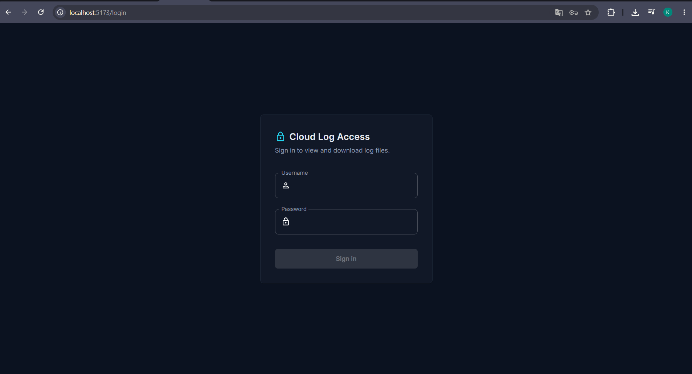
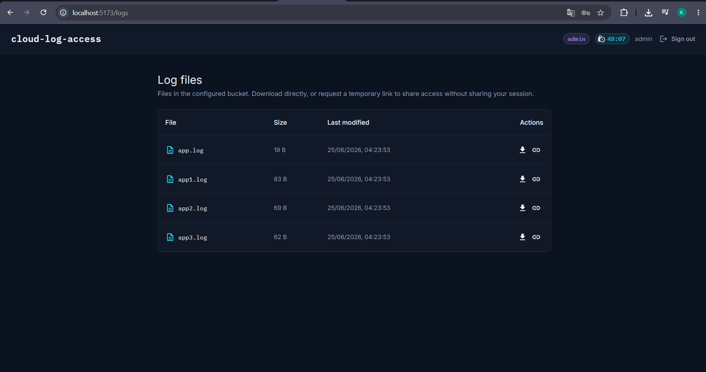
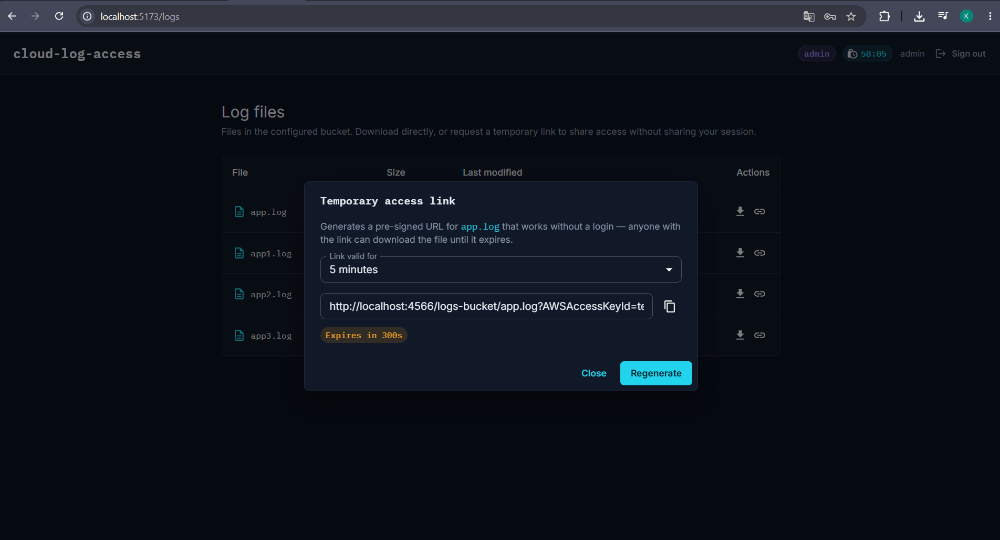
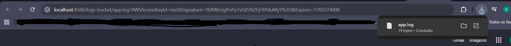

# Cloud Log Access Service

## Overview

Cloud Log Access Service is a full-stack application designed to provide secure access to log files stored in cloud object storage.

The solution includes:

* FastAPI Backend (BFF)
* React Frontend
* JWT Authentication
* Redis Session Management
* Role-Based Authorization (RBAC)
* S3-compatible Storage Integration
* Dockerized Local Environment
* Temporary Pre-Signed Download Links

For local development and demonstration purposes, AWS S3 is simulated using LocalStack.

---

## Architecture

```text
┌─────────────┐
│   React UI  │
└──────┬──────┘
       │
       ▼
┌─────────────┐
│   FastAPI   │
│     BFF     │
└──────┬──────┘
       │
 ┌─────┴─────┐
 ▼           ▼
Redis     S3 Storage
Session   (LocalStack)
```

---

## Features

### Authentication

* JWT-based authentication
* Session persistence using Redis
* Secure logout with session invalidation

### Authorization

* Role-based endpoint protection
* Protected frontend routes
* Backend role validation

### Log Management

* List available log files
* Download log files
* Generate temporary pre-signed download links

### Infrastructure

* Docker Compose environment
* Redis container
* LocalStack S3 container
* Automatic S3 bucket seeding

---

## Technology Stack

### Backend

* Python 3.12
* FastAPI
* Redis
* Boto3
* PyJWT / Python-JOSE

### Frontend

* React
* Material UI
* Axios
* Zustand

### Infrastructure

* Docker
* Docker Compose
* LocalStack

---

## Running the Project

### Requirements

* Docker
* Docker Compose

### Start the Environment

```bash
docker compose up --build
```

This command starts:

* Frontend
* Backend
* Redis
* LocalStack

---

## Accessing the Application

Frontend:

```text
http://localhost:5173
```

Backend Swagger:

```text
http://localhost:8000/docs
```

---

## Demo Credentials

```text
Username: admin
Password: admin123
```

---

## API Endpoints

### Authentication

#### Login

```http
POST /api/login
```

Request:

```json
{
  "username": "admin",
  "password": "admin123"
}
```

Response:

```json
{
  "access_token": "...",
  "token_type": "bearer"
}
```

---

#### Logout

```http
POST /api/logout
```

Requires Authorization header.

---

### Logs

#### List Logs

```http
GET /api/logs
```

Response:

```json
[
  {
    "filename": "app.log",
    "size": 120,
    "last_modified": "2026-06-25T00:00:00"
  }
]
```

---

#### Download Log

```http
GET /api/logs/{filename}
```

Downloads the selected file.

---

#### Generate Temporary Access Link

```http
POST /api/logs/{filename}/presign
```

Request:

```json
{
  "expires_in": 300
}
```

Response:

```json
{
  "url": "http://localhost:4566/...",
  "expires_in": 300
}
```

---

## User Journey

### Login

Insert valid credentials and authenticate.

### View Logs

After authentication, users can view all available log files.

### Download Logs

Users can directly download a selected log file.

### Generate Temporary Access Link

Users can generate a temporary URL that allows downloading a file without authentication until the link expires.

---

## Screenshots

Login Page


Logs Page


Temporary Link Generation


Download with presign link

---

## Security Decisions

### JWT Authentication

Authentication is performed using signed JWT tokens.

### Session Validation

JWTs are additionally validated against Redis-backed sessions.

This enables:

* Immediate logout
* Token revocation
* Session expiration control

### Role-Based Authorization

Protected endpoints validate user roles before granting access.

---

## Design Decisions

### FastAPI

Chosen for its performance, simplicity and automatic OpenAPI documentation.

### Redis

Used to maintain active sessions and support token revocation.

### LocalStack

Used to simulate AWS S3 locally without requiring a cloud account.

### Docker

Provides a reproducible environment and simplifies project execution.

---

## Author

Kaue Soares Ferreira
